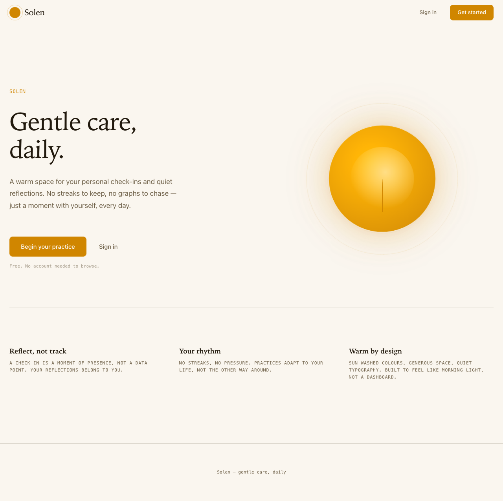

# Solen — gentle care, daily

A habit-tracking and personal check-in app focused on gentle, consistent self-care.



## Tech Stack

**Backend:** Java 17, Spring Boot 3.5, PostgreSQL, Flyway, Gradle, JWT auth  
**Frontend:** React 19, Vite, MUI, Tailwind CSS 4, Recharts, Nivo  
**Testing:** JUnit 5, JaCoCo, Vitest, Playwright  
**Infrastructure:** Docker, Supabase, GitHub

## Repository Structure

```
.
├── backend/                    # Java Spring Boot API
│   ├── src/main/java/org/solen/
│   ├── src/test/java/org/solen/
│   ├── build.gradle
│   └── Dockerfile
├── frontend-web/               # React + Vite SPA
│   ├── src/
│   ├── package.json
│   └── Dockerfile
├── solen_frontend_web/         # Static HTML/CSS prototype
│   ├── index.html
│   ├── landing.html
│   └── ...
└── docs/
    └── screenshots/            # App screenshots
```

## Getting Started

### Prerequisites
- Java 17
- Docker (for local PostgreSQL)
- Node.js 20 (for frontend)

### Backend
```bash
cd backend
docker compose up -d         # start PostgreSQL
cp .env.example .env         # configure secrets
./gradlew bootRun
```

### Frontend
```bash
cd frontend-web
npm install
npm run dev
```

## Key Features
- **Habit tracking** with daily check-ins and streak tracking
- **Categories** for organising habits (hierarchical tree)
- **Mood logging** — AWFUL, BAD, OKAY, GOOD, AWESOME
- **For You Page (FYP)** — public check-in recommendations
- **JWT authentication** with Spring Security

## Architecture

Clean Architecture layered layout:
- **Domain** — core business objects (User, Habit, CheckIn, Category, Mood)
- **Business** — use cases, validators, strategies
- **Persistence** — JPA entities, converters, repositories
- **Controller** — REST endpoints, DTOs, mappers
